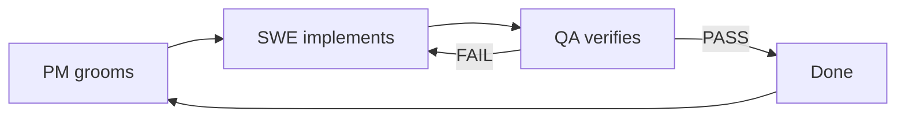

# Household Chores Manager — Project Plan
**Spec-Driven Development • Context Engineering • Loop Engineering • Graph Engineering**

> **Status:** Draft v1.0 — 2026-09-04  
> **Author:** Brainstorming via one-by-one Q&A (voice/dictation friendly)  
> **Audience Decision:** All of the above (flexible) — Roommates / Families with kids / Couples  
> **Platform Decision:** Web app only (responsive, desktop-first, mobile usable)  
> **Feature Scope Decision:** Full home ops — chores + groceries + bills + maintenance  
> **Constraint Decision:** Simple & self-hosted — email/password, VPS/Render, private data  
> **Workflow Decision:** Full AI-native workflow (Context / Loop / Graph)

---

## 1. Vision & Problem Statement

### 1.1 Problem
Shared households fail at chore equity because:
- No single source of truth (verbal promises, sticky notes, scattered chats)
- No fairness tracking — same person always does dishes/trash
- No visibility into overdue, recurring, or seasonal tasks
- No integrated view of related home ops (groceries, bills, maintenance) — leading to duplicate effort

### 1.2 Vision
A **single, calm, web-based home ops hub** where any household (2–8 people, roommates, partners, or families with kids) can create, assign, rotate, and verify chores with transparent fairness, minimal nagging, and full data ownership via self-hosting.

**Tagline:** *“Everyone knows what’s next, who’s up, and that it’s fair.”*

### 1.3 Goals (Checkable)
- [ ] A new household can be created and onboard 2–6 members in < 3 minutes
- [ ] ≥ 90% of recurring chores auto-schedule without manual re-creation after initial setup
- [ ] Fairness dashboard shows imbalance > 20% within one click
- [ ] Works on desktop Chrome/Firefox/Safari + mobile browsers (no install required)
- [ ] Self-hostable with Docker Compose in < 10 min on a $5 VPS

### 1.4 Non-Goals (Out of Scope for V1)
- Native iOS/Android apps (wrap PWA later, not V1)
- AI voice dictation / chat-bot creation (capture requirement for V2, but not V1)
- Marketplace / hiring cleaners, heavy financial accounting, or IoT device integration
- Real-time video / chat — use existing tools (WhatsApp/Telegram); we integrate via links, not rebuild

---

## 2. Audience & Personas (Flexible Household Model)

The app must be **household-type configurable** at creation time. No persona is privileged; the data model supports all.

### Persona A: Alex & Jordan — Roommates / Flatshare (3–5 adults)
- **Need:** Strict equality, rotation, accountability, avoid conflict.
- **Motivation:** “I don’t want to argue about who cleaned the bathroom last.”
- **Key behaviors:** Wants auto-rotation, swap requests, proof-of-completion (photo), weekly digest, no parental hierarchy.

### Persona B: The Rivera Family — Parents + 2 Kids (ages 8, 12)
- **Need:** Parental assignment, age-appropriate chores, rewards, visibility for kids.
- **Motivation:** “Make chores teach responsibility, not spark fights.”
- **Key behaviors:** Needs difficulty levels, points/rewards store, approval flow (kid marks done → parent approves), simple mobile view for kids on tablet.

### Persona C: Sam & Casey — Couple / Partners (2 people)
- **Need:** Division of labor, fairness over time, low overhead.
- **Motivation:** “We just want to feel it’s balanced without micromanaging.”
- **Key behaviors:** Wants effort-weighted points, bi-weekly balance chart, shared grocery/bill lists, minimal notifications.

### Configurable Household Types
```yaml
household_type: [roommates, family, couple, custom]
roles:
  - admin  # creates household, can invite/remove, edit any chore
  - member # equal permissions (roommates/couple)
  - parent # can assign/approve (family)
  - child  # can claim/complete, needs approval, sees simplified UI
```
Family mode enforces `child` cannot delete chores or access bills maintenance admin settings.

---

## 3. Scope — Full Home Ops (MVP + V1.1)

### 3.1 MVP Must-Have (Ship first, block launch if missing)

#### A. Household & Membership
- Create household (name, type, timezone)
- Invite by email link / invite code (no SSO)
- Email + password auth (self-hosted, bcrypt, JWT/session), logout everywhere
- Roles as above, profile (display name, avatar, color)
- Leave / remove member, transfer admin, delete household (with confirmation)

#### B. Chore Core
- CRUD chore: title, description, effort points (1–5), estimated minutes, category (kitchen, bathroom, living, trash, laundry, outdoor, other), due date, recurring rule
- Recurrence: daily / weekly / bi-weekly / monthly / custom cron-like (e.g., “every 2nd Sunday”), auto-generates next instance on completion
- Assignment modes:
  - **Assigned** (someone owns it)
  - **Unassigned pool** (anyone can claim)
  - **Rotating** (round-robin by household order or effort-balanced)
- Status flow: `todo → in_progress → done (pending_approval?) → completed → overdue` + `skipped / swapped`
- Complete action: one-click, optional photo proof, optional note
- Overdue detection + visual badges

#### C. Fairness & Visibility
- Dashboard: “This week”, “Up next”, “Overdue”, “My chores” vs “All”
- Fairness meter: points completed per member (week/month/all-time), effort-weighted, bar + line chart
- History log: who did what, when, points earned
- Activity feed (audit) — last 50 events

#### D. Home Ops Extensions (Full Ops MVP slice)
- **Groceries (light):** Shared list (add/check/remove), quantity, assignee for shopping trip, “move to chore” (e.g., “Buy groceries” chore linked)
- **Bills (light):** Recurring bill tracker (name, amount, due date, payer rotation, paid toggle) — NOT a full accounting ledger
- **Maintenance:** Seasonal / infrequent tasks (e.g., “Clean gutters — every 6 months”, “Replace air filter — every 90 days”), separate tab, long-cycle recurrence

#### E. Notifications (Web-only, no native push)
- In-app bell + email digest (daily 8am + weekly Sunday summary, configurable)
- Overdue reminder email (24h after due)
- Swap/claim request notification

### 3.2 V1.1 Should-Have (Post-MVP, before polish)
- Swap / trade chores (request → accept/decline)
- Approval flow toggle per household (family mode on, roommates off)
- Comments on chores
- Templates: “Starter pack” (family, flatshare, couple) to prefill 10–15 chores
- Export: CSV of history, iCal feed for due chores
- Search + filter (by assignee, category, due, status)
- PWA installability + offline read cache (still web-only, progressive enhancement)

### 3.3 V2 Nice-to-Have (Explicitly Defer)
- Leaderboards, streaks, gamified rewards store, penalties
- Native mobile push, SMS/WhatsApp/Telegram bot
- Voice / dictation creation (“Hey, add ‘clean fridge Friday’”)
- Bill splitting & payment integration (Splitwise-style)
- AI suggestions (“You always do dishes on Mondays, auto-schedule?”)

---

## 4. User Journeys (Critical Paths)

**J1 — Onboard flatshare (3 roommates):**
1. Alex creates household “Sunset Flat” (type: roommates) → invites Jordan & Taylor via link → they set password
2. Alex picks template “Flatshare starter” → 12 chores auto-created with rotating assignment
3. Jordan gets weekly digest email, opens “This week”, claims “Take trash Tuesday”, marks done with photo
4. Fairness dashboard shows Alex 12 pts, Jordan 10 pts, Taylor 4 pts → Taylor auto-assigned next heavy chore

**J2 — Family approval:**
1. Parent creates “Rivera Home” (family) → adds kids as `child` roles
2. Parent assigns “Walk dog — daily 7am” to 12-yo with 3 pts, approval required
3. Child marks done → parent gets in-app notification → approves → points awarded → child sees progress toward “Ice cream” reward (V1.1)

**J3 — Couple balance:**
1. Couple creates household, adds chores with effort (dishes 1 pt, bathroom 5 pts)
2. Groceries list: Sam adds “Oat milk x2”, Casey checks while shopping
3. Bill “Rent — $1800 due 1st” auto-rotates payer, Casey marks paid
4. Sunday summary email shows 30-day balance bar: Sam 52% vs Casey 48% — “feels fair”

---

## 5. Functional Requirements (Specification-Ready)

| ID | Requirement | Acceptance (checkable) |
|---|---|---|
| F-01 | Auth: email/password, JWT httpOnly cookie, reset via email token | Login/logout works, password hashed bcrypt, token expiry 7d, reset email sent |
| F-02 | Household CRUD + invite | Create < 60s, invite link valid 7d, max 8 members household |
| F-03 | Chore CRUD + recurrence | Recurrence generates next instance automatically; editing single vs series works |
| F-04 | Three assignment modes | Assigned / pool / rotating each create correct initial assignee |
| F-05 | Status flow | Cannot mark completed twice; overdue computed server-side by dueAt < now() AND status != completed |
| F-06 | Fairness calculation | Sum(effort) per member per window; unit test covers edge (unassigned, swapped) |
| F-07 | Dashboard filters | “My chores” shows only where assignee == me OR pool; “Overdue” sorted by due asc |
| F-08 | Groceries list | Concurrent edits last-write wins, optimistic UI; no data loss on refresh |
| F-09 | Bills tracker | Due date reminder fires; paid toggle audit logged |
| F-10 | Maintenance | Separate from chores in nav, but shares recurrence engine |
| F-11 | Email notifications | Daily 8am digest job runs; togglable per user |
| F-12 | Audit log | Every create/update/complete/delete emits event with actor, timestamp, diff |

---

## 6. Non-Functional Requirements

- **Self-hosted simplicity:** `docker compose up` → app + Postgres + mail pit; 1 env file; backup via pg_dump cron; docs include 10-min VPS guide
- **Web-only performance:** First paint < 1.5s on 3G, Lighthouse ≥ 90, no heavy JS framework bloat
- **Privacy:** No third-party trackers, no analytics by default, GDPR delete-my-data endpoint, data stays on host
- **Security:** OWASP top 10: hashed passwords, CSRF, XSS escape, rate limit login (5/min), zod validation, SQL via ORM parameterized
- **Accessibility:** WCAG 2.1 AA, keyboard navigable, screen-reader labels, color not sole indicator for status
- **i18n ready:** English V1, strings externalized for future translation
- **Testability:** Unit coverage ≥ 80% for domain logic, e2e for 3 critical journeys

---

## 7. Data Model (Initial)

```prisma
User { id, email unique, passwordHash, name, avatarUrl, color, createdAt }
Household { id, name, type, timezone, createdAt, inviteCode }
Membership { userId, householdId, role: admin|member|parent|child, joinedAt } // composite PK
Chore { id, householdId, title, description, category, effort(1-5), minutes, status, assigneeId?, recurrenceRule?, dueAt, completedAt?, proofUrl?, createdBy }
ChoreRecurrence { id, choreId, rrule (RFC5545), nextDueAt } // derived table or computed
GroceryItem { id, householdId, name, qty, checked, addedBy, checkedBy? }
Bill { id, householdId, name, amount, currency, dueAt, recurrenceRule?, payerId?, paidAt?, status }
MaintenanceTask { id, householdId, title, intervalDays, lastDoneAt?, nextDueAt, assigneeId? }
Activity { id, householdId, actorId, action, entityType, entityId, diff jsonb, createdAt }
```

Indexes: `(householdId, status, dueAt)`, `(assigneeId)`, `(householdId, createdAt)` for activity.

Fairness view = materialized query `SELECT member, SUM(effort) WHERE completedAt BETWEEN :from AND :to GROUP BY member`.

---

## 8. UX / IA (Web App Only)

**Navigation:** Dashboard | Chores | Groceries | Bills | Maintenance | History | Settings

- **Dashboard:** 4 cards (Overdue, Due today, My queue, Fairness bar), weekly calendar strip
- **Chores list:** Table + kanban toggle, filters (assignee, category, status), bulk actions
- **Chore detail drawer:** Edit, comments (V1.1), history, photo proof
- **Create chore modal:** Title, effort slider, due date picker, recurrence builder (visual: “Every ___”), assignee mode radio
- **Settings:** Household type, members, notification prefs, invite, delete household, export CSV/iCal

Design token guidance in `_docs/design-system.md` (to be created via Context Engineering).

---

## 9. Technology Stack — Recommendation Process

> Per workflow: **Plan → Stack Selection → Backlog**. This plan does NOT lock stack; it lists constraints so the coding agent can propose 2–3 options.

**Constraints from decisions:**
- Web app only, self-hosted, simple auth, Docker deployable, private data
- Review capabilities assumption: team comfortable reviewing TypeScript + React + Node (adjust if needed)

**Agent Task (next step):** Propose stacks and recommend one.

*Suggested proposals to evaluate:*
1. **Option A (Recommended for reviewability):** Next.js 15 (App Router) + Tailwind + shadcn/ui + Prisma + PostgreSQL + NextAuth (credentials) + Resend/Nodemailer + Docker — best docs, simple self-host, familiar
2. **Option B (Lightweight):** Remix or SvelteKit + Drizzle + SQLite (Litestream) + Lucia Auth — smaller bundle, single file DB, great for VPS
3. **Option C (Python):** Django + HTMX + Postgres + Tailwind — if reviewers prefer Python, batteries-included admin

**Selection criteria:** Self-host ease, auth simplicity, recurrence handling, testability, reviewer familiarity, bundle size.

**Decision record:** Add to `_docs/stack-decision.md` after selection.

---

## 10. AI-Native Workflow Setup (Context / Loop / Graph Engineering)

This section defines **how we build**, per the 4 core concepts.

### 10.1 Spec-Driven Development

**Workflow:**
```
Brainstorming (this plan, Q&A one-by-one) → Plan Creation (_docs/plan.md) → Stack Selection → Backlog (_docs/tasks.md) → GitHub Issues (source of truth) → Implementation loops
```

- No code before `_docs/plan.md` is approved.
- Every task in `_docs/tasks.md` uses strict template: Goal / Description / Acceptance Criteria (checkable) / Constraints / Out-of-Scope.
- Agent must not assume — if spec ambiguous, open a `question` label issue and block.

### 10.2 Context Engineering — Standardized Files

```
/
├── AGENTS.md / CLAUDE.md          # Entry point: test/build commands, top-level rules, “read plan.md first”
├── _docs/
│   ├── plan.md                    # ← this file (vision + spec)
│   ├── process.md                 # Operational rules, responsibilities, issue workflows
│   ├── tasks.md                   # Modular backlog (synced to GitHub Issues)
│   ├── task-template.md           # Template for all tasks
│   ├── design-system.md           # Tokens, components, a11y rules (load only when UI task)
│   ├── testing-guidelines.md      # Unit/e2e patterns, coverage thresholds (load only when testing)
│   ├── stack-decision.md          # Stack options + ADR
│   └── team/
│       ├── pm.md                  # Product Manager persona
│       ├── software-engineer.md   # Software Engineer persona
│       └── qa-engineer.md         # QA Engineer persona
└── .opencode/ or .agent/           # Harness config for loop commands
```

**Rule:** Agents load `AGENTS.md` + `plan.md` + `process.md` every session. Domain docs loaded dynamically by task label (`ui` → design-system.md, `testing` → testing-guidelines.md). Every correction during session must prompt an update to the relevant doc (“continuous feedback”).

**AGENTS.md starter:**
```markdown
# AGENTS
- Stack: see _docs/stack-decision.md (once chosen)
- Commands: pnpm install, pnpm dev, pnpm test, pnpm lint, pnpm build
- Rules: No code without groomed issue; commit per acceptance criterion; never close issue — QA does
- Must read: _docs/plan.md, _docs/process.md
```

### 10.3 Loop Engineering — Automate with Checkable Stop Conditions

Goals are `/goal` commands the harness loops until programmatically verifiable.

| Goal Command | Stop Condition (checkable) | Agent Persona |
|---|---|---|
| `/goal groom all issues` | Every open issue has Goal/AC/Constraints/Out-of-scope + labels, no `needs-grooming` remains | PM |
| `/goal implement issue #N` | Code + unit tests committed, `pnpm test` passes for that module, AC checklist in issue commented | SWE |
| `/goal qa issue #N` | QA posts PASS (all AC verified) or FAIL with logs; never both; issue moved to done/failed | QA |
| `/goal sync tasks` | `gh issue list` count == `_docs/tasks.md` count, titles match | PM |

**Rules:**
- Only checkable conditions (e.g., `pnpm test --run` exit 0, `gh issue view` shows AC). Never “make it cleaner.”
- Harness runs agent iteratively; agent decides when to continue vs stop based on condition.

### 10.4 Graph Engineering & Multi-Agent Orchestration

State machine: `backlog → groomed → in_progress → in_review (qa) → done | failed → backlog`

**Personas (files in `_docs/team/`):**

- **PM (`pm.md`):** Grooms issues into concrete goals, checkable AC, constraints, explicit out-of-scope. Writes no code. Owns `tasks.md` ↔ GitHub sync.
- **Software Engineer (`software-engineer.md`):** Implements exclusively against AC, writes unit tests, commits progress, comments AC checklist, never closes issue.
- **QA Engineer (`qa-engineer.md`):** Independently tests against AC (fresh checkout, `pnpm test`, manual web flow), outputs strict verdict `PASS` or `FAIL` with diagnostic logs. Writes no code fixes — opens follow-up issue if fail.

**Routing:**


Labels drive routing: `role:pm`, `role:swe`, `role:qa`, `status:groomed`, `status:qa`.

---

## 11. Backlog Generation (Next Step)

After stack selection, the agent must break this plan into `\_docs/tasks.md` modular tasks, each using the template below, then sync as GitHub Issues.

**Task Template (`_docs/task-template.md`):**
```markdown
## Task: <short title>
**Goal:** One sentence, imperative: “Enable ... so that ...”
**Description:** 2–4 sentences, context + user value
**Acceptance Criteria (checkable):**
- [ ] AC1: Given ... when ... then ... (verifiable via command/UI)
- [ ] AC2: ...
**Constraints:** Stack, file locations, no out-of-scope tech
**Out of Scope:** Explicitly not doing
**Labels:** `type:feature|chore|bug`, `area:auth|chores|...`, `role:swe`, `effort:S|M|L`
**Dependencies:** # issue numbers
```

**Proposed Initial Backlog (12–15 issues, to be formalized):**
1. Project scaffolding + Docker + CI + `AGENTS.md`/`process.md`/team docs
2. Auth: email/password + invite + membership + household create
3. Chore CRUD + status flow
4. Recurrence engine (rrule + next instance generation)
5. Assignment modes (assigned / pool / rotating)
6. Dashboard + filters + overdue logic
7. Fairness meter + history + activity feed
8. Groceries list (shared)
9. Bills tracker (recurring)
10. Maintenance tasks (long-cycle)
11. Notifications: in-app + email digest jobs
12. Export CSV + iCal + templates
13. Testing guidelines + e2e for 3 journeys + coverage gate
14. Docs: README, self-host guide, backup/restore

Each maps to a GitHub Issue — single source of truth. `tasks.md` is generated view, not the source after sync.

---

## 12. Process & Issue Workflow (`_docs/process.md` outline)

- **Branching:** `main` protected, `feat/issue-#N-slug`, PR requires QA PASS comment
- **Issue lifecycle:** `needs-grooming → groomed → in_progress → in_review → done`; only PM grooms, only QA closes
- **Commit convention:** `feat(#12): add rotating assignment — AC1, AC2`
- **Continuous feedback:** If agent makes mistake (e.g., assumes family mode), update `plan.md` or `testing-guidelines.md` in same PR
- **Weekly sync:** `/goal groom all issues` + `/goal sync tasks` runs before sprint

---

## 13. Milestones & Timeline (Indicative)

| Phase | Duration | Exit Criteria |
|---|---|---|
| Phase 0 — Plan + Stack + Context docs | 3 days | `plan.md` approved, `AGENTS.md`, `process.md`, team personas merged |
| Phase 1 — MVP Scaffolding + Auth + Households | 1 week | Can create household, invite, auth works, Docker builds |
| Phase 2 — Chore Core + Recurrence + Assignment | 1.5 weeks | All chore AC pass, unit tests ≥80%, e2e J1 passes |
| Phase 3 — Fairness + Dashboard + Home Ops light | 1.5 weeks | Dashboard + groceries/bills/maintenance work, J2/J3 passes |
| Phase 4 — Notifications + Export + Polish | 1 week | Digests send, CSV/iCal, a11y + perf gates pass |
| Phase 5 — QA Hardening + Self-host docs | 3 days | Full e2e suite green, self-host guide tested on clean VPS |

---

## 14. Risks & Mitigations

| Risk | Impact | Mitigation |
|---|---|---|
| Flexible household model overcomplicates V1 | Delays, confusing UX | Ship `type` as config, share 90% code; hide family-only fields behind flag; start with roommates path e2e |
| Recurrence edge cases (DST, monthly) | Bugs, duplicate chores | Use `rrule` lib + server TZ (household timezone), unit test DST transitions, store UTC |
| Self-hosted email deliverability | No digests | Default to in-app + log fallback; document SMTP/Mailpit; use Resend if cloud option later |
| Fairness calculation disputes | User distrust | Effort slider + transparent formula in UI tooltip, allow manual point override per chore |
| Web-only notification fatigue | Users ignore | Digest batching, granular prefs, overdue only after 24h, no spam on every edit |

---

## 15. Success Metrics (Post-Launch)

- Activation: ≥70% of created households add ≥5 chores in first session
- Retention: ≥40% weekly active households after 4 weeks (self-reported, no tracker, via opt-in ping or survey)
- Fairness: Support tickets about “unfair assignment” < 5%
- Self-host: Time-to-first-chore on fresh VPS < 10 min (measured via docs test)
- Quality: No critical bugs > 48h, test coverage ≥80%

---

## 16. Open Questions (To Resolve Before Stack Selection)

- [ ] Confirm VPS target (Hetzner vs Render vs Fly.io) for Docker base image choice
- [ ] Email provider for self-hosted: built-in SMTP vs Resend API fallback?
- [ ] Photo proof storage: local volume vs S3-compatible (MinIO) — impacts Docker Compose
- [ ] Should `child` role require parent email confirmation for invites?

> Next step per workflow: **Ask coding agent to propose 2–3 stacks based on this plan.md and select one best suited to review capabilities**, then generate `_docs/tasks.md` and sync GitHub Issues.

---

## Appendix A: Brainstorming Log (One-by-One Q&A)

| Q | Answer | Implication |
|---|---|---|
| Who is primary audience? | All of the above (flexible) | Configurable household_type + roles; UI must handle both equal adults and parent/child hierarchy |
| Which core features for MVP? | Full home ops | Include groceries + bills + maintenance as light modules, not full accounting; share recurrence engine |
| How to access? | Web app only | Responsive web, no native, no PWA required for MVP but leave PWA door open; no app store overhead |
| Constraints for auth/hosting/privacy? | Simple & self-hosted | Email/password + JWT, Docker Compose + Postgres, no OAuth requirement, data stays private, docs for $5 VPS |
| Include full AI-native workflow? | Yes, full workflow | Generate AGENTS.md, process.md, team personas, loop goals, tasks.md → GitHub Issues orchestration |

---

## Appendix B: File Checklist to Create Next

- [ ] `AGENTS.md` (and `CLAUDE.md` symlink)
- [ ] `_docs/process.md`
- [ ] `_docs/task-template.md`
- [ ] `_docs/stack-decision.md` (after stack proposal)
- [ ] `_docs/tasks.md` (then `gh issue create` sync)
- [ ] `_docs/design-system.md`
- [ ] `_docs/testing-guidelines.md`
- [ ] `_docs/team/pm.md`, `software-engineer.md`, `qa-engineer.md`
- [ ] `docker-compose.yml`, `Dockerfile`, `.env.example`, `README.md`

*End of plan — ready for stack selection and backlog generation.*
